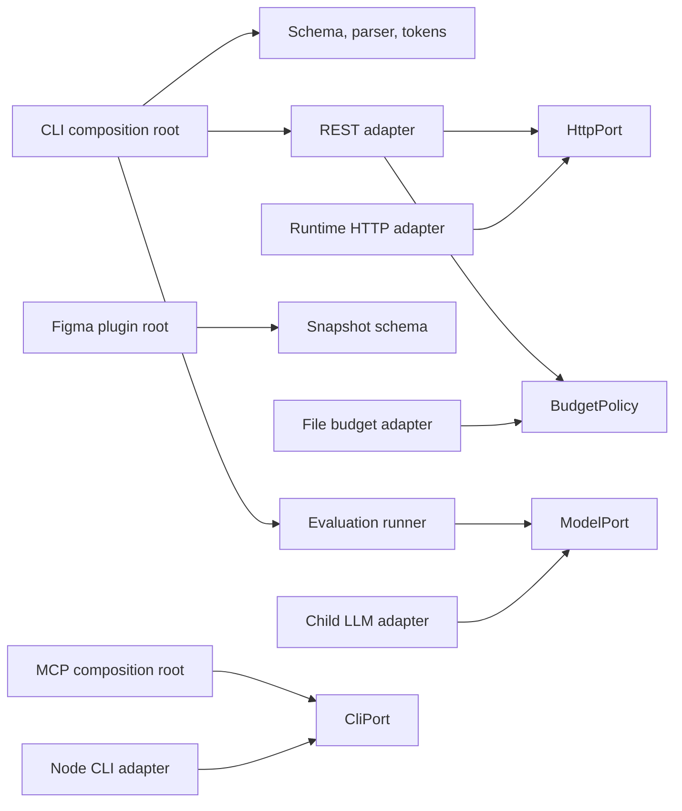

# Functional hexagonal architecture

tokenloom keeps deterministic design logic at the center and places Figma, processes, files, and CLI transport at explicit seams.
The structure adapts ports and adapters to a TypeScript command-line tool without adding Java service classes, framework dependency injection, or one interface per command.

## Package roles

| Role | Packages and files | Responsibility |
|---|---|---|
| Core contracts | `packages/schema` | Validated Snapshot, DesignContext, AgentContext, token, run, and verification shapes |
| Core transforms | `packages/parser`, `packages/tokens` | Pure design-context construction, Agent projection, and token generation |
| Figma input adapters | `packages/adapters/plugin`, `packages/adapters/rest` | Convert Plugin API and REST data to Snapshot |
| Local infrastructure | `packages/cache`, REST budget file adapter | Cache snapshots and persist budget usage |
| Inbound and composition roots | `apps/cli`, `packages/mcp/src/index.ts`, plugin `code.ts` | Parse requests, assemble dependencies, invoke inward modules, and map results to transport output |
| Development tooling | `packages/eval`, `packages/verify`, `bench`, `scripts` | Evaluate generated code and verify repository contracts without becoming a dependency of the product core |

The workspace packages are technical modules in one tokenloom product context.
They are not separate business domains.

## Dependency direction

Dependencies point from a concrete adapter or composition root toward the interface it uses.
Core packages never import adapters, apps, evaluation, verification, benchmarks, or scripts.
Parser and token packages depend on schema contracts.
Schema may use Zod for validation and deterministic Node primitives where the contract requires them.

## Explicit seams

- `packages/eval/src/model-port.ts` defines model execution independently of the child-process adapter.
- `packages/eval/src/agent-session-port.ts` holds pure, I/O-free trajectory types.
  `AgentSessionPort` composes turns, while transport-agnostic `ToolPort` defines tool requests and responses.
- `packages/eval/src/claude-session-adapter.ts` is the concrete adapter and an approved composition root.
  `ChildRun` in `packages/eval/src/child.ts` remains the only child-process boundary.
- `packages/adapters/rest/src/http-port.ts` defines HTTP execution independently of the runtime fetch adapter.
- `packages/mcp/src/cli-port.ts` defines CLI invocation independently of the Node child-process adapter.
- `packages/adapters/rest/src/budget-policy.ts` owns pure budget-window arithmetic and its Budget contract; `budget.ts` persists it to files.

Each port is a structural TypeScript interface at an existing technology seam.
Callers receive dependencies as function arguments or assembled objects.
No runtime dependency-injection framework is required.

## Error and data boundaries

- Adapters normalize external data to Snapshot before it reaches parser or token logic.
- Pure modules return typed values and expected failures rather than choosing CLI exit codes.
- Composition roots map those results to stdout, stderr, MCP responses, or exit codes.
- The REST adapter owns Figma field names and network behavior.
- The file adapter owns budget persistence; budget policy owns arithmetic.
- Reference output verifies public command behavior through the built CLI.

## Automated architecture checks

The root `architecture.test.ts` uses ArchUnitTS with `tsconfig.base.json`.
It runs inside the existing `pnpm test` command, so it is covered by fast CI, by the test gate, and by the verifier self-test.
The suite checks directed package dependencies, cycles, port and adapter naming, type-only edges, and I/O exclusions for pure modules.
Agent projection isolation is checked through dependency-graph edges. The CLI command test replaces the parser projector at its executable module seam, and built CLI and MCP tests cover the default shared output path without constraining import spelling.

ArchUnitTS 2.4.0 reads the selected JSON configuration directly and does not normalize inherited `extends` options before resolving aliases.
For that reason, `tsconfig.base.json` directly owns workspace `paths` and the shared architecture-scan include and exclude values.
The root and plugin TypeScript configurations extend it while retaining their program-specific include and exclude behavior.
See the tagged [graph extractor](https://github.com/LukasNiessen/ArchUnitTS/blob/v2.4.0/src/common/extraction/extract-graph.ts) and [package metadata](https://github.com/LukasNiessen/ArchUnitTS/blob/v2.4.0/package.json).

Update the architecture tests and this guide together when a new package or technology seam changes the dependency graph.
