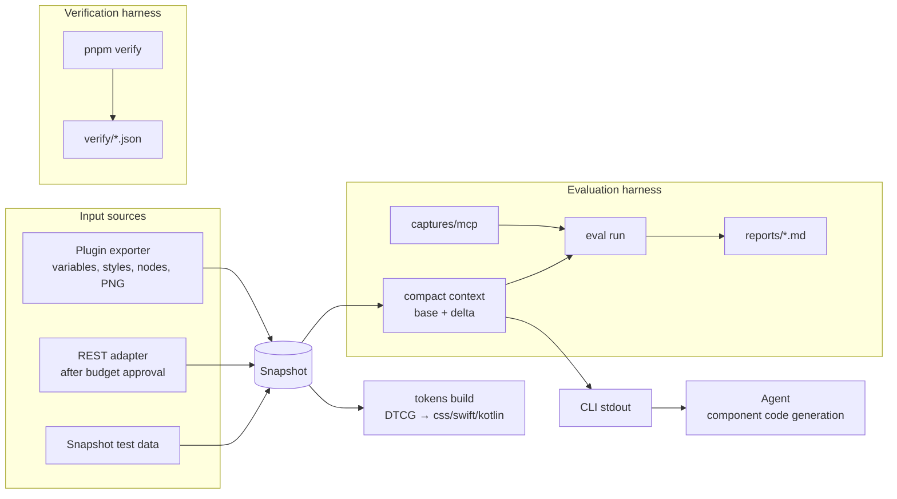

# tokenloom technical specification

`docs/goals.md` states the product goal and its invariants, and `docs/reference/verification.md` defines the gates that check them.
This document is the technical contract for what tokenloom builds and how it behaves.
Rules carry stable IDs, and the rule-traceability gate requires those IDs in matching test descriptions.

## 0. Operating constraints by Figma plan

Sources: the Figma REST API rate-limit, Variables API, MCP rate-limit and access, remote-server installation, Starter-plan, variable-mode, and MCP-server documentation.
The limits below were verified against official documentation on 2026-09-02, including a REST rate-limit page updated on 2025-11-17.
"Needs verification" marks a capability that the cited documentation did not settle directly.

| Capability | Starter (free) | Professional Dev/Full | Enterprise Full |
|---|---|---|---|
| Personal access token (PAT) | Available, maximum 90-day expiry | Available | Available |
| REST Tier 1: `GET file`, `GET file nodes`, `GET images` | Up to 20 calls per month; demand may lower the limit | 10 calls per minute | 20 calls per minute |
| REST Tier 2: comments, image fills, and related endpoints | 5 calls per minute | 25 calls per minute | 100 calls per minute |
| REST Tier 3: components, styles, file metadata, and related endpoints | 10 calls per minute | 50 calls per minute | 150 calls per minute |
| Variables REST API | Unavailable (403) | Unavailable | Available |
| Dev Mode and Dev Mode annotations | Unavailable | Available | Available |
| Dev Mode annotations in REST node responses | Unavailable | Available, observed on Professional on 2026-09-05 | Needs verification |
| MCP desktop server | Unavailable | Available | Available |
| MCP remote server at `https://mcp.figma.com/mcp` | 20 tool calls per month | 200 calls per day and 10 per minute | 600 calls per day and 20 per minute |
| MCP client | Catalogued clients such as Claude Code only; custom clients are unavailable | Same | Same |
| Plugin execution and local development-plugin import | Available; confirm in the target account | Available | Available |
| Variables and text styles through the Plugin API | Available | Available | Available |
| PNG through Plugin API `exportAsync` | Available without a call limit | Available | Available |
| Variable modes | One mode per collection | Up to 10 | Up to 40 |
| Team design files | 3 files plus unlimited drafts | Unlimited | Unlimited |

Rate limits follow the plan that owns the file.
A Starter draft remains on Starter limits even when the user has a paid seat.
A Starter 429 response can carry a `Retry-After` measured in days; one reported case was about 397,000 seconds.

### 0.1 Consequences of these constraints

1. The plugin exporter is the primary path for real files because it can read variables, text styles, nodes, and PNGs.
2. REST calls run only after passing the budget ledger in section 4.10.
   The ledger checks each minute, day, or month window independently and applies the configured limit and reserve.
   One `sync` for no more than 50 component sets spends 2 Tier 1 calls: discovery and one node batch.
   Discovery uses `discoverDepth` from `tokenloom.config.ts`, with a default of 4.
   A component set nested in a section or frame does not appear in a depth-2 response.
   If the discovered set count differs from the expectation, the command stops before the node batch to avoid spending another call on the wrong file.
3. A 429 is not retried by default because a retry storm can consume the monthly budget.
4. MCP baselines use the remote server through Claude Code.
   One capture uses 3 tool calls, all charged to the selected plan window in section 4.10.
5. Plugin and REST Dev Mode annotations normalize to `devmode`; Tier 2 comments provide a free-plan fallback, and both sources merge under the same rule.
6. Multiple modes such as light and dark are verified with synthetic test data because a free-plan real file has one mode per collection.
7. Every contract in this document stays reproducible with the committed sample designs and no Figma account.

## 1. Overview

Figma inputs normalize to `Snapshot` as defined in section 4.1, then follow two paths.

- The deterministic path produces DTCG JSON, CSS variables, Swift, and Kotlin without an LLM call.
- The generation path extracts component-specific design context, writes it to CLI stdout, and supplies it to a code-generation agent.

The evaluation harness in section 8 varies input source and evaluation input variant independently, then reports token usage, latency, token compliance, and visual similarity.
The input sources are snapshot and MCP.
The evaluation input variants are raw, compact design context, and compact design context with annotations.

Non-goals come from `docs/goals.md`.

## 2. Back-of-the-envelope model

The original sizing model assumed 200 component sets, 2,000 variables, 2 synthetic modes, and about 100k nodes.

### 2.1 Data size

- A full-file REST response is about 50MB of JSON and can occupy 6-10x that size on the Node heap.
  At ten times the modeled file size, loading the full response risks an out-of-memory failure.
  Discovery uses `GET /v1/files/:key?depth=discoverDepth`, and content uses batches of up to 50 IDs through `GET /v1/files/:key/nodes?ids=`.
  The REST option `geometry=paths` is forbidden because it expands responses sharply.
  The measured file contained 78 component sets at depth 4; selecting 4 sets from one page used a single node batch, for 2 Tier 1 calls total.
- A plugin export of 200 sets was estimated at about 50MB and 5-15 seconds in the browser sandbox.
  Page-level splitting keeps a ten-times-larger file within memory limits.
- Brotli or Zstandard was expected to compress a 50MB cache entry to about 5MB and decompress plus parse it in about 30ms.

### 2.2 Design-context compression

- A raw component subtree of 50-500KB was expected to become 2-8KB of compact design context.
- Repeating 20 variants as full trees at 3KB each costs 60KB, while one base plus deltas was expected to cost 5-8KB.
- Measured JSON prompts used 2.86-3.02 bytes per token on 2026-09-03.
  `icon-button/raw` measured 137,087B and 47,873 tokens; `twenty-variants/raw` measured 233,695B and 77,410 tokens using `cache_creation` usage.
  Planning divides bytes by 2.8.
  The adapter contributes about 3.6k fixed tokens, so the prompt body alone is about 3.2 bytes per token.
  The estimate is conservative for large prompts and underestimates small or Unicode-heavy prompts by part of that fixed cost.
  Recorded API `usage` replaces the estimate after a call.

### 2.3 Processing time

- Compiling 2,000 variables across 2 modes and 3 platforms produces about 12k lines and was modeled below 0.5 seconds with custom emitters.
- Compact context was modeled at several microseconds per node, about 10ms for a 500KB subtree near 2k nodes.
  The 100ms p99 target leaves about one order of magnitude of headroom.

### 2.4 LLM cost

- Generating 200 components for 3 platforms with 3 attempts produces 1,800 calls.
  At 30k raw tokens this is 54M tokens, compared with 5.4M at 3k compact-context tokens.
  At the original assumed price of $15 per million tokens, the comparison was $810 versus $81.
- The MVP matrix contains 3 sample designs, 3 evaluation input variants, and 1 repetition, for 9 combinations.
  The target was at most 20k input tokens and 2k output tokens per call and $2.50 per matrix set.
  The two 2026-09-03 measured sets cost $2.2986 and $2.2823.
- The full modeled harness contained 240 calls and was expected to take about 30 minutes at 6-way concurrency and 40 seconds per call.

### 2.5 Growth boundaries

- At ten times the modeled number of component sets, split plugin exports by page and merge them with `--from a.json,b.json`.
  Design-context extraction and evaluation remain component-scoped.
- At one hundred times the modeled size, incremental synchronization by file-version diff would need a new design.

## 3. Design decisions and reversal signals

### 3.1 Input path

| Criterion | A. Direct MCP | B. REST plus parser | C. Plugin exporter |
|---|---|---|---|
| Starter limit | 20 tool calls per month | 20 Tier 1 calls per month | No API-call limit |
| Variable values | Included in tool response | Enterprise only | Available |
| PNG | `get_screenshot`, budgeted | Tier 1, budgeted | Unmetered `exportAsync` |
| Deterministic cache | No | Yes | Yes |
| Automation | Agent session | CI and CLI | One manual designer action |
| Input tokens per component | 5k-50k | 0.5k-2k CLI output | 0.5k-2k |

Decision: use the plugin exporter as the primary real-file path, REST for budgeted comparison and comment collection, and MCP as an evaluation baseline.
Reversal signal: a paid Dev or Full seat can promote REST because the adapter boundary already exists.
If MCP reliably returns compact responses at or below 2k tokens, reduce the separate design-context layer.

### 3.2 Token emitters

| Criterion | Style Dictionary v4 | Custom emitters |
|---|---|---|
| Determinism | Requires output-order and header post-processing | Fully controlled |
| Mode handling | Requires custom formats | Designed directly |
| Estimated LOC | About 300 for configuration and formatters | About 400 |
| Dependencies | One direct plus transitive dependencies | None |
| Reversal signal | Four or more platforms or a required ecosystem transform | Not applicable |

Decision: use custom emitters.
At the original scope, CSS, Swift, and Kotlin each required about 100 lines, and removing post-processing simplified byte-level reference output.

### 3.3 Language and integration surface

- Use TypeScript throughout because the plugin requires it and every adapter, parser, CLI, and plugin shares the Zod schemas.
- Prefer the CLI for agent integration to avoid loading a fixed MCP tool schema into every session.
  The MCP adapter remains a thin wrapper over the CLI.
- Use a pnpm workspace without a separate build orchestrator at the current package scale.

## 4. Interfaces

### 4.1 Snapshot schema

```ts
// packages/schema/src/snapshot.ts
import { z } from "zod";

export const VarId = z.string();
export const NodeId = z.string();
export const Color = z.object({ r: z.number(), g: z.number(), b: z.number(), a: z.number() }); // 0~1

export const VarValue = z.union([Color, z.number(), z.string(), z.boolean(), z.object({ alias: VarId })]);

export const Variable = z.object({
  id: VarId,
  name: z.string(),                        // Preserved Figma name: "color/button/primary/bg"
  collectionId: z.string(),
  type: z.enum(["COLOR", "FLOAT", "STRING", "BOOLEAN"]),
  valuesByMode: z.record(z.string(), VarValue),
});

export const Collection = z.object({
  id: z.string(),
  name: z.string(),
  modes: z.array(z.object({ id: z.string(), name: z.string() })),
  defaultModeId: z.string(),
});

export const TextStyle = z.object({
  id: z.string(),
  name: z.string(),                        // "label/md"
  fontFamily: z.string(),
  fontSize: z.number(),
  fontWeight: z.number(),
  lineHeight: z.number(),                  // px
  letterSpacing: z.number().optional(),
});

export interface RawNodeT {
  id: string;
  name: string;
  type: string;                            // Figma node-type string; unknown values are allowed
  visible: boolean;
  bbox: { x: number; y: number; w: number; h: number };
  layout?: {
    mode: "HORIZONTAL" | "VERTICAL" | "NONE";
    gap?: number;
    padding?: [number, number, number, number];   // top, right, bottom, left
    primaryAlign?: "MIN" | "CENTER" | "MAX" | "SPACE_BETWEEN";
    counterAlign?: "MIN" | "CENTER" | "MAX";
    sizingH?: "HUG" | "FILL" | "FIXED";
    sizingV?: "HUG" | "FILL" | "FIXED";
  };
  fills?: { type: "SOLID" | "IMAGE" | "GRADIENT" | "OTHER"; color?: { r: number; g: number; b: number; a: number } }[];
  strokes?: { color: { r: number; g: number; b: number; a: number }; weight: number }[];
  radius?: number | [number, number, number, number];
  opacity?: number;
  text?: { characters: string; fontFamily: string; fontSize: number; fontWeight: number; lineHeight: number };
  bound: {
    fill?: string; stroke?: string; strokeWeight?: string; gap?: string;
    padding?: [string?, string?, string?, string?];
    radius?: string; textStyle?: string; opacity?: string;
  };
  mainComponentId?: string;
  children: RawNodeT[];
  extra?: Record<string, unknown>;          // Remaining fields preserved by the adapter
}
export const RawNode: z.ZodType<RawNodeT> = z.lazy(() => z.object({
  id: NodeId, name: z.string(), type: z.string(), visible: z.boolean(),
  bbox: z.object({ x: z.number(), y: z.number(), w: z.number(), h: z.number() }),
  layout: z.object({
    mode: z.enum(["HORIZONTAL", "VERTICAL", "NONE"]),
    gap: z.number().optional(),
    padding: z.tuple([z.number(), z.number(), z.number(), z.number()]).optional(),
    primaryAlign: z.enum(["MIN", "CENTER", "MAX", "SPACE_BETWEEN"]).optional(),
    counterAlign: z.enum(["MIN", "CENTER", "MAX"]).optional(),
    sizingH: z.enum(["HUG", "FILL", "FIXED"]).optional(),
    sizingV: z.enum(["HUG", "FILL", "FIXED"]).optional(),
  }).optional(),
  fills: z.array(z.object({ type: z.enum(["SOLID", "IMAGE", "GRADIENT", "OTHER"]), color: Color.optional() })).optional(),
  strokes: z.array(z.object({ color: Color, weight: z.number() })).optional(),
  radius: z.union([z.number(), z.tuple([z.number(), z.number(), z.number(), z.number()])]).optional(),
  opacity: z.number().optional(),
  text: z.object({ characters: z.string(), fontFamily: z.string(), fontSize: z.number(), fontWeight: z.number(), lineHeight: z.number() }).optional(),
  bound: z.object({
    fill: z.string().optional(), stroke: z.string().optional(), strokeWeight: z.string().optional(), gap: z.string().optional(),
    padding: z.tuple([z.string().optional(), z.string().optional(), z.string().optional(), z.string().optional()]).optional(),
    radius: z.string().optional(), textStyle: z.string().optional(), opacity: z.string().optional(),
  }),
  mainComponentId: z.string().optional(),
  children: z.array(RawNode),
  extra: z.record(z.string(), z.unknown()).optional(),
}));

export const ComponentSet = z.object({
  id: NodeId,
  name: z.string(),
  props: z.record(z.string(), z.array(z.string())),   // { variant: ["primary","secondary"], size: ["md"] }
  components: z.array(z.object({
    id: NodeId,
    props: z.record(z.string(), z.string()),
    root: RawNode,
    renderPng: z.string().optional(),      // Relative samples/<name>/render/<id>.png path
  })),
});

export const Annotation = z.object({
  nodeId: NodeId,
  text: z.string(),
  author: z.string().optional(),
  source: z.enum(["devmode", "comment", "sample"]),
});

export const Snapshot = z.object({
  version: z.literal(1),
  source: z.object({
    kind: z.enum(["rest", "plugin", "sample"]),
    plan: z.enum(["starter", "pro", "org", "enterprise", "unknown"]),
    fileKey: z.string(),
    fileVersion: z.string(),
    fetchedAt: z.string(),                  // Recorded by the adapter and copied by the parser
    apiVersion: z.string().optional(),
    exporter: z.object({ sha: z.string(), builtAt: z.string() }).optional(),   // Bundle stamp with build time
    annotationsSupport: z.enum(["read", "unsupported"]).optional(),            // Runtime annotation support; synthetic test data may omit it
  }),
  collections: z.array(Collection),
  variables: z.array(Variable),
  textStyles: z.array(TextStyle),
  componentSets: z.array(ComponentSet),
  annotations: z.array(Annotation),
});
export type SnapshotT = z.infer<typeof Snapshot>;
```

New snapshots and annotations use the `sample` source value.
The decoder accepts the legacy on-disk value `fixture` in existing sample data and normalizes it to `sample` before core logic runs.
Writers never emit the legacy value.

Only the REST and plugin adapters know Figma field names.
The parser and token builder consume only `Snapshot`.
Adapters omit fills and strokes where `visible` is false, while preserving Figma order in the `fills` array.
`bound.fill` and `bound.stroke` refer to the first paint that remains after visibility filtering.
The CLI loader reapplies the same filtering and binding rules when it reads a stored snapshot.
The plugin export format adds `renderPngBase64` to `Snapshot`; `tokenloom snapshot import` writes each PNG separately and replaces it with a `renderPng` path.

Plugin adapter reference points, checked against `@figma/plugin-typings` at runtime, are `figma.variables.getLocalVariablesAsync()`, `getLocalVariableCollectionsAsync()`, `figma.getLocalTextStylesAsync()`, `ComponentSetNode.componentPropertyDefinitions`, `ComponentNode.variantProperties`, `node.boundVariables` such as `fills`, `itemSpacing`, and `paddingLeft`, `TextNode.textStyleId`, and `node.exportAsync({ format: "PNG", constraint: { type: "SCALE", value: 2 } })`.
The REST adapter uses `@figma/rest-api-spec` types.

### 4.2 Design-context schema

```ts
// packages/schema/src/design-context.ts
import { z } from "zod";

export const TokenRef = z.string().regex(/^[a-z][a-z0-9]*(\.[a-z0-9-]+)+$/);
export const StyleValue = z.string().regex(/^([a-z][a-z0-9]*(\.[a-z0-9-]+)+|raw:.+)$/);

export interface DesignNodeT {
  id: string;
  role: "container" | "text" | "icon" | "image" | "instance" | "unknown";
  name: string;
  layout: {
    dir: "row" | "col" | "none";
    gap?: string | number;
    pad?: (string | number)[];
    align?: "start" | "center" | "end" | "between";
    crossAlign?: "start" | "center" | "end";
    sizing: { w: "hug" | "fill" | "fixed"; h: "hug" | "fill" | "fixed" };
    size?: { w?: number; h?: number };
  };
  style: Record<string, string>;
  text?: { content: string; typo?: string };
  icon?: { name: string };
  instanceOf?: string;
  children: DesignNodeT[];
  raw?: Record<string, unknown>;
}
export const DesignNode: z.ZodType<DesignNodeT> = z.lazy(() => z.object({
  id: z.string(),
  role: z.enum(["container", "text", "icon", "image", "instance", "unknown"]),
  name: z.string(),
  layout: z.object({
    dir: z.enum(["row", "col", "none"]),
    gap: z.union([TokenRef, z.number()]).optional(),
    pad: z.array(z.union([TokenRef, z.number()])).length(4).optional(),
    align: z.enum(["start", "center", "end", "between"]).optional(),
    crossAlign: z.enum(["start", "center", "end"]).optional(),
    sizing: z.object({ w: z.enum(["hug", "fill", "fixed"]), h: z.enum(["hug", "fill", "fixed"]) }),
    size: z.object({ w: z.number().optional(), h: z.number().optional() }).optional(),
  }),
  style: z.record(z.string(), StyleValue),
  text: z.object({ content: z.string(), typo: TokenRef.optional() }).optional(),
  icon: z.object({ name: z.string() }).optional(),
  instanceOf: z.string().optional(),
  children: z.array(DesignNode),
  raw: z.record(z.string(), z.unknown()).optional(),
}));

export const Delta = z.object({ path: z.string(), value: z.unknown() });   // RFC 6901 from base.root; null deletes

export const WarningCode = z.enum([
  "UNBOUND_COLOR", "UNBOUND_DIMENSION", "UNBOUND_TYPO",
  "ABSOLUTE_POSITION", "UNKNOWN_NODE_TYPE", "NAME_COLLISION",
  "NON_ASCII_TOKEN_NAME", "VARIANT_STRUCTURE_DIFF", "ALIAS_CYCLE",
  "MODE_COLLAPSED",
]);

export const DesignContext = z.object({
  version: z.literal(1),
  source: z.object({
    fileKey: z.string(), nodeId: z.string(), fileVersion: z.string(),
    fetchedAt: z.string(),
    contentHash: z.string(),               // "sha256:" plus the stable JSON hash of the component-set subtree
  }),
  component: z.object({
    name: z.string(),
    block: z.string(),                     // BEM block
    props: z.record(z.string(), z.array(z.string())),
    base: z.object({ props: z.record(z.string(), z.string()), root: DesignNode }),
    variants: z.array(z.object({
      props: z.record(z.string(), z.string()),
      delta: z.array(Delta).optional(),
      root: DesignNode.optional(),
    })),
  }),
  tokensUsed: z.array(TokenRef),
  annotations: z.array(z.object({
    nodeId: z.string(),
    kind: z.enum(["intent", "a11y", "behavior", "note"]),
    text: z.string(),
  })),
  warnings: z.array(z.object({ code: WarningCode, nodeId: z.string(), detail: z.string() })),
});
```

### 4.3 Base and variant-delta rules

| ID | Rule |
|---|---|
| D01 | The base component uses the first value of each property in `props` array order. |
| D02 | Each other variant pairs nodes with the base by child-index path and `name`, then stores only changed leaf values in `delta`. Root node names are not compared because each root `name` contains its variant-property string. |
| D03 | If non-root child counts or names differ, the variant stores its complete `root` and emits `VARIANT_STRUCTURE_DIFF`. |
| D04 | `delta` is sorted lexicographically by `path`, which is an RFC 6901 JSON Pointer. |
| D05 | `applyDelta(base.root, delta)` is deeply equal to the variant's compact tree. |

### 4.4 RawNode to DesignNode rules for compact context

| ID | Decision | Rule |
|---|---|---|
| R01 | Node removal | Remove the entire subtree when `visible === false`. |
| R02 | Role | `TEXT` becomes `text`. `INSTANCE` becomes `instance`, does not expand children, and uses the main-component slug for `instanceOf`. An image fill becomes `image`. A vector-like node with a bounding box no larger than 48 by 48 becomes `icon`, with its slug in `icon.name`. `FRAME`, `COMPONENT`, `GROUP`, and `RECTANGLE` become `container`. Every other type becomes `unknown` and emits `UNKNOWN_NODE_TYPE`. The root design-context `name` is always `component.block`. |
| R03 | Direction | `HORIZONTAL` becomes `row`, `VERTICAL` becomes `col`, and absent or `NONE` becomes `none`. |
| R04 | Absolute placement | A node with `dir === "none"` and at least two children emits `ABSOLUTE_POSITION`. Bounding boxes appear only in `raw.bbox` at `--level full`. |
| R05 | Gap | Use a TokenRef when `bound.gap` exists. Otherwise, a positive gap stays numeric and emits `UNBOUND_DIMENSION`; zero is omitted. |
| R06 | Padding | Apply R05 independently to all four sides and omit padding when all sides are zero. |
| R07 | Alignment | Map `MIN` to `start`, `CENTER` to `center`, `MAX` to `end`, and `SPACE_BETWEEN` to `between`. Counter alignment becomes `crossAlign`. |
| R08 | Sizing | Map `HUG` to `hug`, `FILL` to `fill`, and `FIXED` to `fixed` with `size`. Default to `hug`. |
| R09 | `style.bg` and `style.fg` | For a solid first fill, use its TokenRef when `bound.fill` exists. Otherwise use `raw:#hex` and emit `UNBOUND_COLOR`. Text nodes use `fg`. |
| R10 | `style.border` | Treat the first stroke color as in R09. Use the `bound.strokeWeight` TokenRef for `style.borderWidth`; otherwise use `raw:<n>px` without an unbound warning. |
| R11 | `style.radius` | Use the `bound.radius` TokenRef. Otherwise, a positive radius becomes `raw:<n>px` and emits `UNBOUND_DIMENSION`. |
| R12 | `style.opacity` | Include only values below 1. |
| R13 | Text | Map `characters` to `content`. Use `bound.textStyle` for `typo`, or emit `UNBOUND_TYPO` when absent. |
| R14 | Omitted data | Omit absolute bounding-box coordinates, vector geometry, defaults such as `opacity: 1`, `visible: true`, empty arrays, and all `extra` data. |
| R15 | Color format | Map `round(c × 255)` to lowercase `#rrggbb`; append alpha as `#rrggbbaa` when `a < 1`. |
| R16 | Full context | Apply R01-R15 unchanged and add `{ bbox, type, extra }` under `raw`. |
| R17 | `tokensUsed` | Include only leaf paths that exist in token files. Expand the compound `text.typo` path into `fontFamily`, `fontSize`, `fontWeight`, `lineHeight`, and `letterSpacing` when present, while retaining the compound path in `text.typo` itself. |

### 4.5 Name and token-path rules

| ID | Rule |
|---|---|
| N01 | Replace `/` with `.` in variable and style names. Prefix text-style paths with `typo.`. |
| N02 | The grammar is `<segment>(.<segment>){0,4}`. The first segment matches `[a-z][a-z0-9]*(-[a-z0-9]+)*`; later segments match `[a-z0-9]+(-[a-z0-9]+)*`. Single-segment paths are valid, and the first segment is the category. Category membership and the segment limit are not otherwise validated. Treat invalid paths as in N03. |
| N03 | Normalize each token-path segment with N04 before validation. If any other character remains, emit `NON_ASCII_TOKEN_NAME` and exclude the path without transliteration. If normalization makes two paths equal, emit `NAME_COLLISION` for both and exclude both. Treat bindings to excluded variables as unbound and emit the applicable R05, R09, R11, or R13 warning. |
| N04 | Layer slug: preserve Unicode letters and digits, replace other runs with one `-`, trim leading and trailing `-`, and lowercase. |
| N05 | Duplicate component names emit `NAME_COLLISION`. CLI `context` exits 1 with candidate IDs. Any candidate node ID that occurs once proceeds with `--node`; a requested name and node ID that still match multiple sets, or a name collision with no unique candidate ID, remains ambiguous and requires a corrected snapshot. |
| N06 | If distinct canonical paths map to one platform name, emit `NAME_COLLISION` for both and exclude both. For example, `title-page.font-family` and `title.page.font.family` both become `--title-page-font-family`. |

### 4.6 Token extraction from Snapshot to DTCG

| ID | Rule |
|---|---|
| T01 | A single-mode collection writes `tokens/base.json`. |
| T02 | A multi-mode collection writes one `tokens/mode.<slug>.json` per mode. |
| T03 | `{ alias }` becomes the reference string `"{path}"`. |
| T04 | An alias cycle emits `ALIAS_CYCLE` and makes `tokens build` exit 1. |
| T05 | `COLOR` becomes `$type: "color"` using the R15 format. |
| T06 | A `FLOAT` in category `space`, `radius`, `size`, or `border` becomes `$type: "dimension"` with `"<n>px"`. |
| T07 | Every other `FLOAT` becomes `$type: "number"`. |
| T08 | `STRING` → `"string"`, `BOOLEAN` → `"boolean"` |
| T09 | A text style writes `fontFamily`, `fontSize`, `fontWeight`, `lineHeight`, and optional `letterSpacing` under `typo.<name>` with their corresponding DTCG types. |
| T10 | File keys use lexicographic path order. |

### 4.7 Platform-output rules

| Canonical path | CSS | Swift | Kotlin |
|---|---|---|---|
| `color.button.primary.bg` | `--color-button-primary-bg` | `ColorToken.buttonPrimaryBg` | `ColorToken.buttonPrimaryBg` |
| `space.md` | `--space-md` | `SpaceToken.md` | `SpaceToken.md` |
| `typo.label.md.fontSize` | `--typo-label-md-font-size` | `TypoToken.labelMdFontSize` | `TypoToken.labelMdFontSize` |

| ID | Rule |
|---|---|
| O01 | CSS writes base plus the default mode under `:root` and other modes under `[data-theme="<mode>"]`. Blocks sort by mode name and variables sort by name. Output has no comments and ends with one newline. |
| O02 | Preserve aliases as `var(--...)`; write literals as lowercase hex or `px`. |
| O03 | Swift writes `enum <Category>Token { static let ... }` per category. Only color tokens branch by mode, using `UIColor { trait in ... }`. |
| O04 | Kotlin writes `object <Category>Token { val ... }` per category and colors as `Color(0xAARRGGBB)`. Only branching colors use `@Composable` getters; other members remain `val` constants. |
| O05 | Token-name sets are identical across all three platform outputs. |
| O06 | Emitters are custom implementations that use only `stableStringify` and sorted string assembly. |
| O07 | Swift and Kotlin branch by mode only when a collection has exactly two modes whose N04 slugs end in the set `{light, dark}`. The `dark` suffix supplies the dark branch and the other mode supplies the default. Every other collection and every non-color token in a multi-mode collection emits only its `defaultModeId` value and one `MODE_COLLAPSED` warning per token. `detail` joins discarded mode slugs with `,` in lexicographic order. |
| O08 | A single-segment path belongs to Swift `enum RootToken` and Kotlin `object RootToken`. Apply the section 4.7.1 `w(seg)` rule to its member name. RootToken is always first, and a literal `root` category creates an N06 collision. CSS writes `--<segment>`. |

The evaluation harness requires generated component CSS to follow this contract:

- Use `component.block` as the block, for example `.button`, `.button__label`, and `.button--variant-secondary`.
- Use only `var(--...)` for colors, spacing, and typography; literals and `var()` fallbacks are forbidden.
- Add no framework runtime dependency.

#### 4.7.1 Swift and Kotlin emitter format

(1) Sources and ordering

| Item | Rule |
|---|---|
| Input | Flatten DTCG reference output into canonical-path and leaf pairs. |
| `:root` set | `base.json` plus each collection's default-mode file. |
| Branch set | Non-default mode files, used only when O07 permits branching. |
| Type order | Ascending category name. |
| `RootToken` | Contains single-segment canonical paths under O08, always appears first, and applies `w(seg)` to member names. |
| Member order | Ascending canonical token path by code-unit `<` comparison. |
| Between types | One blank line, with none after the last type. |
| File ending | One LF newline, UTF-8, no BOM. |
| Comments | None. |

(2) Number formatting

| Item | Rule |
|---|---|
| Integer | Write `16`, never `16.0`. |
| Decimal | Use the shortest round-trip form from JavaScript `String(n)`, such as `1.5` and `0.5`. |
| Remove `px` | Convert a DTCG `$value` of `"16px"` to its number because the target type carries the unit. |
| Kotlin `Float` suffix | Write `$type: number` as `600f`. |
| Kotlin `Dp`/`TextUnit` | `16.dp`, `14.sp` |
| Swift | `static let md: CGFloat = 16` |

(3) Type mapping

| DTCG `$type` | Swift | Kotlin |
|---|---|---|
| `color` | `UIColor` | `Color` |
| `dimension`, category `typo` | `CGFloat` | `TextUnit` (`.sp`) |
| Other `dimension` | `CGFloat` | `Dp` (`.dp`) |
| `number` | `CGFloat` | `Float` |
| `fontFamily`, `string` | `String` | `String` |
| `boolean` | `Bool` | `Boolean` |

Always emit type annotations.

(4) Colors

| Item | Rule |
|---|---|
| Source | DTCG `#rrggbb` or `#rrggbbaa` from R15. |
| Conversion | `#rrggbb` becomes `0xffrrggbb`; `#rrggbbaa` becomes `0xaarrggbb`. |
| Case | Lowercase hexadecimal, such as `0xff1a73e8`. |
| Kotlin | `Color(0xff1a73e8)` |
| Swift | `UIColor(hex: 0xff1a73e8)`, provided by a file-local `private extension UIColor`. |

(5) Aliases

Preserve an alias as a reference to another static member instead of resolving it, matching O02 for CSS.
Always qualify the reference with its owning type, such as `ColorToken.brand500`, even inside the same type.
The same rule handles cross-category aliases without depending on declaration order.

(6) String quoting

| Item | Rule |
|---|---|
| Swift | Wrap with `"` and escape `\` and `"`. |
| Kotlin | Wrap with `"` and escape `\`, `"`, and `$`. |

(7) Preamble

| Item | Rule |
|---|---|
| Swift import | Exactly one `import UIKit` line. |
| Swift helper | Emit `private extension UIColor { convenience init(hex: UInt32) }` only when at least one color token exists. |
| Kotlin imports | Emit only used imports in ascending code-unit order. |
| Kotlin `package` | None, because Snapshot provides no package-name source. |
| After the preamble | One blank line. |

Kotlin import candidates and conditions:

| Import | Condition |
|---|---|
| `androidx.compose.foundation.isSystemInDarkTheme` | At least one mode-branching member. |
| `androidx.compose.runtime.Composable` | At least one mode-branching member. |
| `androidx.compose.ui.graphics.Color` | At least one `Color` member. |
| `androidx.compose.ui.unit.Dp`, `androidx.compose.ui.unit.dp` | At least one `Dp` member. |
| `androidx.compose.ui.unit.TextUnit`, `androidx.compose.ui.unit.sp` | At least one `TextUnit` member. |

(8) Mode-branch shape

Swift retains `static let` because `UIColor(dynamicProvider:)` resolves its dynamic color against the trait at draw time.

```swift
    static let buttonPrimaryBg: UIColor = UIColor { trait in
        trait.userInterfaceStyle == .dark ? <O07 dark value> : <O07 default value>
    }
```

Kotlin uses a custom getter because `isSystemInDarkTheme()` is `@Composable` and cannot initialize a constant.

```kotlin
    val buttonPrimaryBg: Color
        @Composable get() = if (isSystemInDarkTheme()) <O07 dark value> else <O07 default value>
```

Both files use four-space indentation.

(9) Identifier derivation

For canonical path `c.s1.s2...sn`:

- Type name is `Capitalize(w(c)) + "Token"`. Because N02 permits `-` in categories, apply the same `w(seg)` transformation first, as in `title-page` to `TitlePageToken`.
- Member name is `w(s1) + Capitalize(w(s2)) + ... + Capitalize(w(sn))`. `w(seg)` splits on `-`, preserves the first piece, and capitalizes the first ASCII character of later pieces, as in `brand-alt` to `brandAlt`.

Prefix a member that starts with a digit with `_`, as in `_500Brand`.
Wrap any member in the union of both languages' reserved words with backticks in both outputs, even if only one language reserves it.
Canonical paths remain unchanged, preserving O05; the name-set comparison removes backticks and a leading `_` first.

Reserved-word union:

```
Swift: associatedtype class deinit enum extension fileprivate func import init inout internal let open
       operator private protocol public rethrows static struct subscript typealias var break case
       continue default defer do else fallthrough for guard if in repeat return switch where while
       as Any catch false is nil super self Self throw throws true try
Kotlin: as break class continue do else false for fun if in interface is null object package return
        super this throw true try typealias typeof val var when while
```

Apply this union to both files, so either language reserving a word makes both outputs use backticks.

### 4.8 Annotation protocol

- Parse a leading `[intent]`, `[a11y]`, or `[behavior]` tag; use `note` when none exists.
- Attach an annotation without a specific node to the component-set root.
- Plugin and REST adapters share one rule: use only a node annotation's string, nonempty `label` as text with `source: "devmode"`; neither falls back to `labelMarkdown`. Ignore property-only annotations because fixed width or spacing values are not intent text. When both `label` and `properties` exist, use only `label` as `text`. Tier 2 comments remain the free-plan fallback with `source: "comment"`. Merge both sources, then sort once by (`nodeId`, `text`) with the code-point comparator.
- The parser classifies tags and node ownership without interpreting annotation meaning.
- Sort design-context `annotations` by (`nodeId`, `text`) and `warnings` by (`code`, `nodeId`).

### 4.9 CLI contract

```
Common flags
  --from <a.json>[,<b.json>]   Read Snapshot or plugin-export files instead of cache. Merge componentSets and let later variables win by id.
                               A plugin export loads directly: embedded renderPngBase64 is dropped, no render file is written, and no
                               renderPng reference is emitted. `snapshot import` stays the route when render files on disk are wanted.
                               Because contentHash hashes the component-set subtree (section 4.2) and only the imported route carries a
                               renderPng path, the two routes agree on every field except contentHash. It stays a subtree hash, not a
                               design identity comparable across routes.
                               An input carrying renderPngBase64 and renderPng together belongs to neither format and exits 1 naming import.
  --json                       Write only JSON to stdout. Logs always use stderr.
  --strict                     Exit 2 when warnings exist.

Exit codes: 0 success; 1 usage or fatal error; 2 --strict warning; 3 network or budget failure; 4 reference-output mismatch

tokenloom tokens build [--from] [--out dist/tokens] [--platform css,swift,kotlin] [--strict]
  Snapshot → <out>/tokens/{base,mode.*}.json → <out>/{css,swift,kotlin}/...
  --json: { files: [...], tokens: n, warnings: [...] }

tokenloom context <componentName> [--node <id>] [--from] [--level compact|full] [--annotations] [--json]
                 [--view canonical|agent] [--variant=<key=value,...>]
tokenloom context [options] -- <componentName>
  Use the standard `--` separator when a component name begins with `--`; every token after it is positional data.
  Options and unknown-option validation remain before the separator.
  stdout: DesignContext JSON. --view agent writes AgentContext JSON instead; the default stays canonical.
  --variant=<selector> selects the base or exactly one variant by exact match and keeps every other field canonical.
    Keys and values use percent-encoded segments, with `%uHHHH` for isolated surrogate code units.
    It works in both views. A rejected selector prints the structured Agent error on stdout under
    --view agent and the existing stderr text otherwise, with exit 1 either way.

tokenloom context [--from] --view agent [--match <text>] [--json]
  Omitting the component name in the Agent view lists the component sets the snapshot holds.
  stdout: { components, count, next, returned, truncated } with at most 20 items, sorted by name, node id, then variant count.
  --match filters that list by case-insensitive substring and cannot be combined with a component name.
  --variant and --node require a component name rather than being ignored by discovery.
  No match is exit 0 with count 0, not empty output. Omitting the name in the canonical view stays a usage error.

tokenloom doctor [--from] [--json]
  Print all warnings grouped by code. Warn when PAT expiry is near at 80 days.

tokenloom init [--project <directory>] [--update]
  Install the Agent Skill into <directory>/.claude/skills/tokenloom/SKILL.md, defaulting to the invocation directory.
  Resolve --project against the invocation directory only; never search upwards for an application root.
  Write .tokenloom-install.json beside it recording the sha256 of the file written. Add nothing else, and never configure MCP.
  Substitute the executable that wrote the file into the Skill, so the agent cannot reach a different build.
  An install matching that hash and this build exits 0 and reports it is already up to date.
  An install matching the recorded hash but differing from this build needs --update; without it, exit 1.
  An install whose content does not match the recorded hash counts as user-edited and is never replaced: exit 1.
  Messages go to stderr; stdout stays empty.

tokenloom snapshot import <export.json> --into samples/<name> [--expect-exporter <sha>] [--plan <plan>] [--file-key <key>]
  Split plugin-export renderPngBase64 values into render/<id>.png files and save snapshot.json.
  --expect-exporter <sha>: exit 1 with a reason when source.exporter.sha is missing, differs, or ends in -dirty. Without the flag, only print the stamp.

tokenloom sync --file <fileKey> [--sets <name,...>]
  Check budget ledger -> REST -> .tokenloom/cache/<fileKey>/<fileVersion>.snapshot.json.br
  --json: { fileVersion, sets, variables, textStyles, annotations, budget: { tier1Used, tier1Cap }, ms }

tokenloom budget [--json]
tokenloom samples refresh --file <fileKey> [--only <name>]
tokenloom samples diff [--only <name>]

tokenloom eval capture --input mcp --node <id>
tokenloom eval run --matrix <yaml> [--parallel 6] [--dry-run] [--budget-usd N]
tokenloom eval report [--since <date>] --out reports/<date>.md
tokenloom eval trajectory --matrix <yaml> [--budget-usd N] [--dry-run] [--json]
```

### 4.10 Configuration and budget ledger

```ts
// tokenloom.config.ts
export default {
  plan: "pro",                                      // Plan with a section 0 column: starter | pro | enterprise
  fileKey: process.env.FIGMA_FILE,
  budget: {},                                       // Override cap or reserve only within the selected plan
  retryAfterMaxSec: 300,
  categories: ["color", "space", "radius", "size", "border", "shadow", "opacity", "typo", "z"],
  patCreatedAt: "2026-09-01",
};
```

`.tokenloom/budget.json`:

```json
{ "calls": { "tier1": [1788343200000, 1788343260000], "mcp": [] }, "adjustments": [] }
```

Each value is a recorded call time in UTC milliseconds.
Usage for a window is the number of records inside that window.

- Before a REST Tier 1 call or MCP capture, read the ledger and exit 3 when `used + n > cap - reserve` in any applicable window. Windows and caps come from the section 0 row selected by `plan`, and `budget` overrides only that row. A plan without a section 0 column cannot open the ledger.
- Retry a 429 once only when `Retry-After ≤ retryAfterMaxSec`. Otherwise exit 3 and write the retry time to stderr. Record failed attempts in the ledger too.
- Minute and day windows slide over the previous 60 seconds and 24 hours; the month window is a UTC calendar month. Discard records outside every window. The ledger supplies all counts because the server sends no rate-limit headers.

### 4.11 Agent context rules

The Agent view is a pure projection of `DesignContext` for code-generation clients.
`docs/goals.md` owns the product targets, and `docs/reference/verification.md` section 12 owns the gate thresholds.

| ID | Rule |
|---|---|
| A01 | `projectAgentContext` does not mutate its input `DesignContext` and produces byte-identical `AgentContext` output for the same input. |
| A02 | The `AgentContext` omits only the top-level `version` and `source` keys. It preserves `component` with its tree, node `id`, `props`, `base`, `variants`, and `delta`, together with every token value. |
| A03 | `tokensUsed`, `annotations`, and `warnings` keep the canonical values and order. |
| A04 | The default `context` view is canonical. Without `--view agent` the existing output bytes do not change. |
| A05 | The Agent projection and selector perform no process, file, or network I/O. The CLI and the MCP adapter call the same core function rather than reimplementing the projection. |

The benchmark gate judges the Agent view on measured bytes and projection time. A token count derived from
bytes, such as `estimateTokens`, is never reported as a real token saving; provider-usage input
tokens are a trajectory criterion.

`AgentContext` lives in `packages/schema` and the projection lives in `packages/parser`.
The MCP `design_context` tool accepts an optional `view` of `canonical` or `agent` and forwards it to the CLI; omitting it preserves the canonical default. The public MCP surface remains exactly `design_context` and `tokens`.
The reviewed Agent reference answer is `samples/button/reference/context.agent.json`; other samples verify the projection through property and regression tests.

### 4.12 Agent selective-disclosure rules

Selective disclosure narrows what the Agent view returns without adding a command or an MCP tool.
Rules A06-A09 are enforced by the same gates as A01-A05.
A10 and A11 govern the evidence a trajectory experiment produces rather than what the Agent view returns, and `docs/reference/verification.md` sections 12.8 and 12.9 own their thresholds.

| ID | Rule |
|---|---|
| A06 | The Variant selector is an exact `key=value,...` match that selects the base or exactly one variant. Each key and value is encoded independently: well-formed text uses percent encoding and an isolated UTF-16 surrogate code unit uses `%uHHHH`. Structural delimiters are split before one decode; a literal percent is `%25`, so text resembling the code-unit escape stays distinct. Empty keys and values are valid when the assignment delimiter is present. The exact standalone `{}` selects only candidates with no own properties; it is not a wildcard or a base alias. An empty selector or a missing delimiter is invalid; braces inside an assignment remain ordinary encoded key or value data. Malformed encodings are invalid. Whitespace around an unencoded pair, key, and value is ignored; decoded values are never trimmed or normalized. Without a selector the output equals the full canonical context. Selection runs after canonical construction, so `tokensUsed`, `annotations`, `warnings`, and the base component keep the values the full context produces. |
| A07 | Component discovery sorts by name, node id, then variant count, so distinguishable emitted items have a total order. It returns the longest leading prefix within both 20 complete items and 4,096 UTF-8 serialized bytes, uses at most four fields per item, and reports `count` for every match alongside `returned` for the page. `--match` is a case-insensitive substring filter and does not change which fields an item carries. |
| A08 | Discovery zero results and Agent JSON failures return an explicit structure rather than empty output. Only discovery and failure responses carry `next`; a successful code-generation context carries none. |
| A09 | The public MCP surface stays exactly `design_context` and `tokens`, and the combined schema estimate stays at or below 800 tokens. |
| A10 | The trajectory report computes its success, token, cost, duration, and turn values from the JSONL run records and never writes those numbers into report code. |
| A11 | An alternate format or delta representation becomes a public contract only when it passes the adoption criteria. A failed experiment keeps its result note and leaves the default contract unchanged. |

A discovery item carries `name` and `variants`, the number of entries `component.variants` would hold.
It carries `id` only when that name appears more than once in the snapshot, decided over the whole snapshot so a `--match` filter cannot change an item's fields.

An Agent failure body is `{ "error": { "code", "detail", ... }, "next": [...] }` on stdout with the existing fatal exit code.
`code` is one of `COMPONENT_NOT_FOUND`, `COMPONENT_SET_EMPTY`, `NAME_COLLISION`, `VARIANT_SELECTOR_INVALID`, `VARIANT_NOT_FOUND`, or `VARIANT_AMBIGUOUS`.
`NAME_COLLISION` adds `candidates`, `VARIANT_SELECTOR_INVALID` adds the known `keys`, and the two remaining variant codes add the `available` selectors.
A name collision recommends `--node` when at least one candidate ID occurs once, including a mixed collision that also contains duplicate IDs. If multiple sets share both the requested name and node ID, or no candidate ID is unique, `NAME_COLLISION` instead reports the duplicate lookup identity and recommends a corrected snapshot.
A known property key is an own key in either `component.props` or a selectable candidate's `props`, so every advertised selector remains valid even when a Snapshot declaration omits a candidate key. An unknown property key is `VARIANT_SELECTOR_INVALID` because the caller must rewrite the selector, while a value that matches nothing is `VARIANT_NOT_FOUND` because the caller must choose from `available`.
The canonical view keeps its existing stderr text and exit codes unchanged.

`next` holds command templates with `<snapshot>`, `<name>`, `<selector>`, `<id>`, and `<text>` placeholders rather than interpolated caller values.
Templates put named values in attached options and put component names after the standard `--` separator. This keeps option-like names and values usable without changing their bytes, keeps names containing spaces or quotes from producing a broken command, and keeps output bytes independent of the input path, which the determinism gate requires.

Selection and discovery live in `packages/parser` as pure functions.
The CLI and the MCP adapter call them and change presentation only.
`design_context` makes `component` optional and forwards `variant` and `match`; omitting `component` in the Agent view returns discovery. For a component beginning with `--`, the adapter emits options first and the unchanged component after the standard separator.

### 4.13 Rejected delta-path representation

A short delta path encoding was measured under A11 and did not reach the adoption bar, so it is neither adopted nor public.
It replaced the `children/<index>` segment pair that RFC 6901 repeats at every depth with a `>`-separated child-index descent, escaping a `>` inside a field name as `~2`.

`DeltaT.path` is RFC 6901 in every serialized artifact, and no CLI command, MCP tool, parser export, or MCP schema exposes the encoding.
The encoder remains owned by `bench/delta-path.bench.ts`; only its reproducibility test imports it, and no production module depends on it.
The benchmark keeps the comparison reproducible and records it as `context.deltaPath`.
That record's `basis` field states that its byte and `estimateTokens` values are derived from the serialized artifact rather than read from provider usage.

`docs/reference/verification.md` section 12.9 owns the bar; the measurement fell short of it, so this representation stays rejected.

### 4.14 Rejected alternate Agent output format

A compact text encoding of the Agent view was measured under A11 as an alternate to Agent JSON.
The experiment concluded without an adoption verdict, so it is neither adopted nor public, and its implementation is removed.

The encoding was line based and had no indentation: a `key<TAB>value` line was one field, a `key<TAB>{` or `key<TAB>[` line opened a container that its own `}` or `]` line closed, an array element occupied one line, and a value was bare text unless quoted, in which case it was a JSON string.
Measured against the `stableJsonFile` bytes the CLI emits, over the nine reference samples, the median payload was 57.69% smaller.
That figure is **artifact-derived, not provider usage**, and it was never the adoption metric.

Agent JSON stays the only representation the Agent view emits.
No CLI command or option, MCP tool or schema value, parser export, evaluation package export, or default output path produces or accepts the encoding, and a trajectory matrix cannot name the `cli-agent-compact` condition.
The run-record reader still accepts that condition, because the records carrying it are committed evidence.
The required 24-run set in `eval/trajectory.yaml` is unchanged.

`docs/reference/verification.md` section 12.9 owns the adoption bar, which is read from provider usage in the run records under A10.
That bar was never applied to the compact condition: the run set stopped at 27 of 32 runs and left the required partition at 21 of 24 rows.
A11 makes an experiment public only when it passes the bar, so the result note stands and the default contract is unchanged, exactly as section 4.13 records for the rejected delta path.
`reports/trajectory.md` records the measurement.

## 5. Reference output and regression references

`samples/button/` contains reviewed reference answers and implementation changes must continue to match them.
`samples/mutations/expected.json` is also authoritative and mirrors the section 5.5 table.
Other sample directories contain generated regression references under `docs/reference/verification.md` section 4.

### 5.1 `samples/button/snapshot.json` input

```json
{
  "version": 1,
  "source": { "kind": "sample", "plan": "unknown", "fileKey": "SAMPLE", "fileVersion": "sample-1", "fetchedAt": "2026-01-01T00:00:00Z" },
  "collections": [
    { "id": "c1", "name": "Primitives", "modes": [{ "id": "m0", "name": "Value" }], "defaultModeId": "m0" },
    { "id": "c2", "name": "Semantic", "modes": [{ "id": "ml", "name": "Light" }, { "id": "md", "name": "Dark" }], "defaultModeId": "ml" }
  ],
  "variables": [
    { "id": "v1", "name": "color/brand/500", "collectionId": "c1", "type": "COLOR", "valuesByMode": { "m0": { "r": 0.102, "g": 0.451, "b": 0.910, "a": 1 } } },
    { "id": "v2", "name": "color/neutral/0", "collectionId": "c1", "type": "COLOR", "valuesByMode": { "m0": { "r": 1, "g": 1, "b": 1, "a": 1 } } },
    { "id": "v3", "name": "color/neutral/100", "collectionId": "c1", "type": "COLOR", "valuesByMode": { "m0": { "r": 0.945, "g": 0.953, "b": 0.957, "a": 1 } } },
    { "id": "v4", "name": "color/neutral/900", "collectionId": "c1", "type": "COLOR", "valuesByMode": { "m0": { "r": 0.122, "g": 0.122, "b": 0.122, "a": 1 } } },
    { "id": "v5", "name": "space/sm", "collectionId": "c1", "type": "FLOAT", "valuesByMode": { "m0": 8 } },
    { "id": "v6", "name": "space/md", "collectionId": "c1", "type": "FLOAT", "valuesByMode": { "m0": 16 } },
    { "id": "v7", "name": "radius/md", "collectionId": "c1", "type": "FLOAT", "valuesByMode": { "m0": 8 } },
    { "id": "v8", "name": "color/button/primary/bg", "collectionId": "c2", "type": "COLOR", "valuesByMode": { "ml": { "alias": "v1" }, "md": { "r": 0.541, "g": 0.706, "b": 0.973, "a": 1 } } },
    { "id": "v9", "name": "color/button/primary/fg", "collectionId": "c2", "type": "COLOR", "valuesByMode": { "ml": { "alias": "v2" }, "md": { "alias": "v4" } } },
    { "id": "v10", "name": "color/button/secondary/bg", "collectionId": "c2", "type": "COLOR", "valuesByMode": { "ml": { "alias": "v3" }, "md": { "r": 0.188, "g": 0.192, "b": 0.204, "a": 1 } } },
    { "id": "v11", "name": "color/button/secondary/fg", "collectionId": "c2", "type": "COLOR", "valuesByMode": { "ml": { "alias": "v4" }, "md": { "alias": "v2" } } }
  ],
  "textStyles": [
    { "id": "t1", "name": "label/md", "fontFamily": "Inter", "fontSize": 14, "fontWeight": 600, "lineHeight": 20 }
  ],
  "componentSets": [
    {
      "id": "12:34", "name": "Button",
      "props": { "variant": ["primary", "secondary"], "size": ["md"] },
      "components": [
        {
          "id": "12:35", "props": { "variant": "primary", "size": "md" },
          "root": {
            "id": "12:35", "name": "Button", "type": "COMPONENT", "visible": true,
            "bbox": { "x": 100, "y": 200, "w": 104, "h": 36 },
            "layout": { "mode": "HORIZONTAL", "gap": 8, "padding": [8, 16, 8, 16], "primaryAlign": "CENTER", "counterAlign": "CENTER", "sizingH": "HUG", "sizingV": "HUG" },
            "fills": [{ "type": "SOLID", "color": { "r": 0.102, "g": 0.451, "b": 0.910, "a": 1 } }],
            "radius": 8,
            "bound": { "fill": "v8", "gap": "v5", "padding": ["v5", "v6", "v5", "v6"], "radius": "v7" },
            "children": [
              {
                "id": "12:36", "name": "Label", "type": "TEXT", "visible": true,
                "bbox": { "x": 116, "y": 208, "w": 72, "h": 20 },
                "fills": [{ "type": "SOLID", "color": { "r": 1, "g": 1, "b": 1, "a": 1 } }],
                "text": { "characters": "Button", "fontFamily": "Inter", "fontSize": 14, "fontWeight": 600, "lineHeight": 20 },
                "bound": { "fill": "v9", "textStyle": "t1" },
                "children": []
              }
            ]
          }
        },
        {
          "id": "12:37", "props": { "variant": "secondary", "size": "md" },
          "root": {
            "id": "12:37", "name": "Button", "type": "COMPONENT", "visible": true,
            "bbox": { "x": 100, "y": 260, "w": 104, "h": 36 },
            "layout": { "mode": "HORIZONTAL", "gap": 8, "padding": [8, 16, 8, 16], "primaryAlign": "CENTER", "counterAlign": "CENTER", "sizingH": "HUG", "sizingV": "HUG" },
            "fills": [{ "type": "SOLID", "color": { "r": 0.945, "g": 0.953, "b": 0.957, "a": 1 } }],
            "radius": 8,
            "bound": { "fill": "v10", "gap": "v5", "padding": ["v5", "v6", "v5", "v6"], "radius": "v7" },
            "children": [
              {
                "id": "12:38", "name": "Label", "type": "TEXT", "visible": true,
                "bbox": { "x": 116, "y": 268, "w": 72, "h": 20 },
                "fills": [{ "type": "SOLID", "color": { "r": 0.122, "g": 0.122, "b": 0.122, "a": 1 } }],
                "text": { "characters": "Button", "fontFamily": "Inter", "fontSize": 14, "fontWeight": 600, "lineHeight": 20 },
                "bound": { "fill": "v11", "textStyle": "t1" },
                "children": []
              }
            ]
          }
        }
      ]
    }
  ],
  "annotations": [
    { "nodeId": "12:34", "text": "[behavior] Enter/Space로 활성화. disabled면 aria-disabled=true.", "source": "sample" },
    { "nodeId": "12:36", "text": "[a11y] 라벨은 시각적으로 숨기지 않는다.", "source": "sample" }
  ]
}
```

### 5.2 Expected compact context at `samples/button/reference/context.compact.json`

```json
{
  "annotations": [
    { "kind": "behavior", "nodeId": "12:34", "text": "Enter/Space로 활성화. disabled면 aria-disabled=true." },
    { "kind": "a11y", "nodeId": "12:36", "text": "라벨은 시각적으로 숨기지 않는다." }
  ],
  "component": {
    "base": {
      "props": { "size": "md", "variant": "primary" },
      "root": {
        "children": [
          {
            "children": [],
            "id": "12:36",
            "layout": { "dir": "none", "sizing": { "h": "hug", "w": "hug" } },
            "name": "label",
            "role": "text",
            "style": { "fg": "color.button.primary.fg" },
            "text": { "content": "Button", "typo": "typo.label.md" }
          }
        ],
        "id": "12:35",
        "layout": {
          "align": "center", "crossAlign": "center", "dir": "row",
          "gap": "space.sm", "pad": ["space.sm", "space.md", "space.sm", "space.md"],
          "sizing": { "h": "hug", "w": "hug" }
        },
        "name": "button",
        "role": "container",
        "style": { "bg": "color.button.primary.bg", "radius": "radius.md" }
      }
    },
    "block": "button",
    "name": "Button",
    "props": { "size": ["md"], "variant": ["primary", "secondary"] },
    "variants": [
      {
        "delta": [
          { "path": "/children/0/style/fg", "value": "color.button.secondary.fg" },
          { "path": "/style/bg", "value": "color.button.secondary.bg" }
        ],
        "props": { "size": "md", "variant": "secondary" }
      }
    ]
  },
  "source": {
    "contentHash": "sha256:PENDING",
    "fetchedAt": "2026-01-01T00:00:00Z",
    "fileKey": "SAMPLE", "fileVersion": "sample-1", "nodeId": "12:34"
  },
  "tokensUsed": [
    "color.button.primary.bg", "color.button.primary.fg",
    "color.button.secondary.bg", "color.button.secondary.fg",
    "radius.md", "space.md", "space.sm", "typo.label.md"
  ],
  "version": 1,
  "warnings": []
}
```

Keys are sorted, deltas use lexicographic `path` order, indentation is two spaces, and the file ends with one newline.
`contentHash` carries its measured value, locked through `reference-lock --only contentHash`.
`reference/warnings.json` is `[]`.
`tokensUsed` reflects the R17 leaf expansion and is updated through `reference-lock` during implementation.

### 5.3 Expected DTCG at `samples/button/reference/tokens/`

`base.json`:

```json
{
  "color": {
    "brand": { "500": { "$type": "color", "$value": "#1a73e8" } },
    "neutral": {
      "0": { "$type": "color", "$value": "#ffffff" },
      "100": { "$type": "color", "$value": "#f1f3f4" },
      "900": { "$type": "color", "$value": "#1f1f1f" }
    }
  },
  "radius": { "md": { "$type": "dimension", "$value": "8px" } },
  "space": {
    "md": { "$type": "dimension", "$value": "16px" },
    "sm": { "$type": "dimension", "$value": "8px" }
  },
  "typo": {
    "label": {
      "md": {
        "fontFamily": { "$type": "fontFamily", "$value": "Inter" },
        "fontSize": { "$type": "dimension", "$value": "14px" },
        "fontWeight": { "$type": "number", "$value": 600 },
        "lineHeight": { "$type": "dimension", "$value": "20px" }
      }
    }
  }
}
```

`mode.light.json`:

```json
{
  "color": {
    "button": {
      "primary": {
        "bg": { "$type": "color", "$value": "{color.brand.500}" },
        "fg": { "$type": "color", "$value": "{color.neutral.0}" }
      },
      "secondary": {
        "bg": { "$type": "color", "$value": "{color.neutral.100}" },
        "fg": { "$type": "color", "$value": "{color.neutral.900}" }
      }
    }
  }
}
```

`mode.dark.json`:

```json
{
  "color": {
    "button": {
      "primary": {
        "bg": { "$type": "color", "$value": "#8ab4f8" },
        "fg": { "$type": "color", "$value": "{color.neutral.900}" }
      },
      "secondary": {
        "bg": { "$type": "color", "$value": "#303134" },
        "fg": { "$type": "color", "$value": "{color.neutral.0}" }
      }
    }
  }
}
```

Hex check: 0.102 -> 26 (1a), 0.451 -> 115 (73), and 0.910 -> 232 (e8).
The values 0.541/0.706/0.973 become 8ab4f8, and 0.188/0.192/0.204 become 303134.
JSON uses two-space indentation, sorted keys, and one final newline.

### 5.4 Expected CSS at `samples/button/reference/css/tokens.css`

```css
:root {
  --color-brand-500: #1a73e8;
  --color-button-primary-bg: var(--color-brand-500);
  --color-button-primary-fg: var(--color-neutral-0);
  --color-button-secondary-bg: var(--color-neutral-100);
  --color-button-secondary-fg: var(--color-neutral-900);
  --color-neutral-0: #ffffff;
  --color-neutral-100: #f1f3f4;
  --color-neutral-900: #1f1f1f;
  --radius-md: 8px;
  --space-md: 16px;
  --space-sm: 8px;
  --typo-label-md-font-family: Inter;
  --typo-label-md-font-size: 14px;
  --typo-label-md-font-weight: 600;
  --typo-label-md-line-height: 20px;
}

[data-theme="dark"] {
  --color-button-primary-bg: #8ab4f8;
  --color-button-primary-fg: var(--color-neutral-900);
  --color-button-secondary-bg: #303134;
  --color-button-secondary-fg: var(--color-neutral-0);
}
```

The two blocks have one blank line between them, and the file ends with one newline.

### 5.5 Mutation samples M01-M15

M01-M12 each introduce one defect into the valid `button` snapshot; M13-M15 exercise selective-disclosure interactions against the same locked inputs.
Expected results live in `samples/mutations/expected.json` and `docs/reference/verification.md` sections 5 and 12.6.

| ID | Defect | Expected result |
|---|---|---|
| M01 | Remove root `bound.fill`. | One `UNBOUND_COLOR`, `style.bg = raw:#1a73e8`, exit 0, or 2 under `--strict`. |
| M02 | Remove root `bound.gap`. | One `UNBOUND_DIMENSION` and `gap = 8`. |
| M03 | Remove Label `bound.textStyle`. | One `UNBOUND_TYPO` and no `text.typo`. |
| M04 | Set both variant roots to `layout.mode = NONE` with three children. | Two `ABSOLUTE_POSITION` warnings, one unique code, and no `VARIANT_STRUCTURE_DIFF`. |
| M05 | Set only the primary Label `type` to `WIDGET`. | One `UNKNOWN_NODE_TYPE`; base Label role is `unknown`, its subtree remains, and the secondary difference is a delta. |
| M06 | Add another component set named `Button` with ID `12:99`. | `context Button` exits 1 and stderr includes `NAME_COLLISION`, `12:34`, and `12:99`. |
| M07 | Set the v5 name to `space/작게`. | One `NON_ASCII_TOKEN_NAME`, no token-file entry, exit 0, or 2 under `--strict`. |
| M08 | Add one child to the secondary root. | One `VARIANT_STRUCTURE_DIFF` and the complete variant `root`. |
| M09 | Make v8 `ml` alias v9 and v9 `ml` alias v8. | `ALIAS_CYCLE`; `tokens build` exits 1. |
| M10 | Set both variant Labels to `visible: false`. | No warnings, empty base `children`, and no `VARIANT_STRUCTURE_DIFF`. |
| M11 | Set `components: []`. | `context Button` exits 1 and stderr contains `no components`. |
| M12 | Give c2 modes a, b, c, and d with default a; c copies a and d copies b. | `mode.a.json` through `mode.d.json`, no warnings, and a under `:root`. |
| M13 | Request an unavailable `size` value in the Agent view. | Exit 1 with a structured `VARIANT_NOT_FOUND` error containing `available`. |
| M14 | Request Agent discovery with `--match definitely-no-match`. | Exit 0 with `count: 0` and `returned: 0`. |
| M15 | Request `context Button --view agent` with annotations. | Exit 0 and preserve canonical annotations, warnings, and node IDs. |

### 5.6 Regression sample designs

| Name | Contents |
|---|---|
| icon-button | A 24 by 24 VECTOR icon plus a label. |
| absolute-card | `layout.mode` NONE with three children. |
| nested-instance | Contains an INSTANCE child. |
| four-modes | A collection with four modes. |
| korean-names | Korean layer names with ASCII token names. |
| single-mode | Every collection has one mode, matching a free-plan real file. |
| twenty-variants | Four sizes by five states for delta-compression verification at no more than 8 KB. |

### 5.7 Expected Swift at `samples/button/reference/swift/Tokens.swift`

```swift
import UIKit

private extension UIColor {
    convenience init(hex: UInt32) {
        self.init(
            red: CGFloat((hex >> 16) & 0xff) / 255,
            green: CGFloat((hex >> 8) & 0xff) / 255,
            blue: CGFloat(hex & 0xff) / 255,
            alpha: CGFloat((hex >> 24) & 0xff) / 255
        )
    }
}

enum ColorToken {
    static let brand500: UIColor = UIColor(hex: 0xff1a73e8)
    static let buttonPrimaryBg: UIColor = UIColor { trait in
        trait.userInterfaceStyle == .dark ? UIColor(hex: 0xff8ab4f8) : ColorToken.brand500
    }
    static let buttonPrimaryFg: UIColor = UIColor { trait in
        trait.userInterfaceStyle == .dark ? ColorToken.neutral900 : ColorToken.neutral0
    }
    static let buttonSecondaryBg: UIColor = UIColor { trait in
        trait.userInterfaceStyle == .dark ? UIColor(hex: 0xff303134) : ColorToken.neutral100
    }
    static let buttonSecondaryFg: UIColor = UIColor { trait in
        trait.userInterfaceStyle == .dark ? ColorToken.neutral0 : ColorToken.neutral900
    }
    static let neutral0: UIColor = UIColor(hex: 0xffffffff)
    static let neutral100: UIColor = UIColor(hex: 0xfff1f3f4)
    static let neutral900: UIColor = UIColor(hex: 0xff1f1f1f)
}

enum RadiusToken {
    static let md: CGFloat = 8
}

enum SpaceToken {
    static let md: CGFloat = 16
    static let sm: CGFloat = 8
}

enum TypoToken {
    static let labelMdFontFamily: String = "Inter"
    static let labelMdFontSize: CGFloat = 14
    static let labelMdFontWeight: CGFloat = 600
    static let labelMdLineHeight: CGFloat = 20
}
```

Types are separated by one blank line, indentation is four spaces, the file ends with one newline, and no comments appear.
Colors convert lowercase `#rrggbbaa` to `0xaarrggbb`; aliases reference other static members without resolving values.

### 5.8 Expected Kotlin at `samples/button/reference/kotlin/Tokens.kt`

```kotlin
import androidx.compose.foundation.isSystemInDarkTheme
import androidx.compose.runtime.Composable
import androidx.compose.ui.graphics.Color
import androidx.compose.ui.unit.Dp
import androidx.compose.ui.unit.TextUnit
import androidx.compose.ui.unit.dp
import androidx.compose.ui.unit.sp

object ColorToken {
    val brand500: Color = Color(0xff1a73e8)
    val buttonPrimaryBg: Color
        @Composable get() = if (isSystemInDarkTheme()) Color(0xff8ab4f8) else ColorToken.brand500
    val buttonPrimaryFg: Color
        @Composable get() = if (isSystemInDarkTheme()) ColorToken.neutral900 else ColorToken.neutral0
    val buttonSecondaryBg: Color
        @Composable get() = if (isSystemInDarkTheme()) Color(0xff303134) else ColorToken.neutral100
    val buttonSecondaryFg: Color
        @Composable get() = if (isSystemInDarkTheme()) ColorToken.neutral0 else ColorToken.neutral900
    val neutral0: Color = Color(0xffffffff)
    val neutral100: Color = Color(0xfff1f3f4)
    val neutral900: Color = Color(0xff1f1f1f)
}

object RadiusToken {
    val md: Dp = 8.dp
}

object SpaceToken {
    val md: Dp = 16.dp
    val sm: Dp = 8.dp
}

object TypoToken {
    val labelMdFontFamily: String = "Inter"
    val labelMdFontSize: TextUnit = 14.sp
    val labelMdFontWeight: Float = 600f
    val labelMdLineHeight: TextUnit = 20.sp
}
```

Imports include only used symbols in ascending code-unit order.
No `package` declaration appears because Snapshot provides no source for one.
Types have one blank line between them, indentation is four spaces, the file ends with one newline, and comments are absent.
Only mode-varying colors use `@Composable` getters; other members remain `val` constants.
Swift and Kotlin reference output exists only under `samples/button`; regression samples retain CSS and design-context references.

## 6. SLO

`docs/goals.md` and `docs/reference/verification.md` section 7 own the SLO values.
If the model in section 2 and the measured result differ by an order of magnitude, correct the model rather than the measurement.

## 7. Architecture, repository, and stack



```
tokenloom/
  README.md  README.ko.md  AGENTS.md  CLAUDE.md  CONTEXT.md
  docs/
    reference/spec.md
    development/     # goal.md, plan.md, tests.md, status.md
    history/         # phases/, decisions/, investigations/, operations/
  packages/
    schema/          # snapshot.ts, design-context.ts, run.ts, verify.ts, stableStringify
    parser/          # Snapshot to design context, doctor, and contentHash
    tokens/          # Snapshot → DTCG → css/swift/kotlin emitter
    adapters/
      plugin/        # Figma plugin built with esbuild, one button plus download
      rest/          # Figma REST to Snapshot behind the budget ledger
    eval/            # capture, run, score, report, prompts/, render/, samples/fake-responses/
    verify/          # Gates, selftest/, and synth.ts
    cache/           # Brotli/Zstandard cache, garbage collection, and budget.json
    mcp/             # MCP server wrapper around the CLI
  apps/cli/          # tokenloom, bundled by esbuild to dist/tokenloom.js; skill/SKILL.md ships beside it for init
  scripts/           # reference-lock.ts, token-name-set-diff.ts
  samples/           # <name>/, mutations/, manifest.json, CHANGES.md
  eval/              # matrix.mvp.yaml, matrix.full.yaml, pricing.json
  verify/            # P<n>-<utc>.json
  reports/  runs/  bench/
  tokenloom.config.ts
```

The stack is TypeScript, Node 22, a pnpm workspace, Zod, citty, esbuild for the CLI and plugin, Vitest, fast-check, PostCSS, Playwright, pixelmatch, pngjs, YAML, `@figma/plugin-typings`, `@figma/rest-api-spec`, and `node:zlib` with Brotli by default and Zstandard when available.
The dependency allowlist is in `docs/reference/verification.md` section 9.

## 8. Failure normalization and observations

| Failure | Response |
|---|---|
| Figma 429 | Retry once when `Retry-After ≤ retryAfterMaxSec`; otherwise exit 3 with the retry time. Record the attempt. |
| Budget exhausted | Exit 3 before the call and continue from cache when available. |
| PAT near 80-day expiry | Emit a `doctor` warning. |
| 5xx | Retry twice with exponential backoff and concurrency one. |
| Unknown node type | Preserve `role: unknown` and emit a warning. |
| Unbound color | Use `raw:#hex` and emit `UNBOUND_COLOR`. |
| Name collision | Emit `NAME_COLLISION`; any candidate ID occurring once can be selected with `--node`, while an ambiguous requested name/node pair or no unique candidate ID requires a corrected snapshot. |
| Alias cycle | Emit `ALIAS_CYCLE` and fail the build. |
| Variant structure mismatch | Store the complete `root` and emit a warning. |
| Corrupt cache | Discard on hash mismatch. |
| Plugin export exceeds memory | Export by page and merge with `--from a,b`. |
| Figma response schema changes | `samples diff` prints field-path differences and capture-based adapter tests fail. |
| MCP tool name changes | Captures retain `tools/list` so reports expose the change. |

Every command appends one observation to `runs/<utc-date>.jsonl`.

```json
{"cmd":"context","target":"Button","bytesIn":312400,"bytesOut":6120,"ratio":51.0,"estTokens":1530,"ms":{"load":12,"compact":8},"warnings":0}
```

## 9. Evaluation harness

### 9.1 Matrix

```yaml
# eval/matrix.mvp.yaml
samples: [button, icon-button, twenty-variants]
inputs: [snapshot]
inputVariants: [raw, compact, compact+annotations]
platforms: [css]
repeats: 1
maxInputTokens: 20000
model: opus

# eval/matrix.mvp-large.yaml (only raw combinations above 20000)
samples: [icon-button, twenty-variants]
inputs: [snapshot]
inputVariants: [raw]
platforms: [css]
repeats: 1
maxInputTokens: 90000
model: opus

# eval/matrix.agent-view.yaml (optional one-shot Agent-view evidence)
samples: [button, icon-button, twenty-variants]
inputs: [snapshot]
inputVariants: [compact+annotations, agent]
platforms: [css]
repeats: 1
maxInputTokens: 20000
model: opus

# eval/matrix.full.yaml (real captured designs)
samples: [<30 samples>]
inputs: [snapshot, mcp]
mcpSets:                       # Captured real-file component sets only
  - { sampleName: real-design-system, node: "4185:3778" }
  - { sampleName: real-annotated-theme, node: "1:13" }
inputVariants: [raw, compact, compact+annotations]
platforms: [css]
repeats: 2
maxInputTokens: 150000
model: opus
```

`model` is required.
Without a fixed value, the `claude --model` default can change between runs and make comparisons invalid under section 9.6.
Each run passes this value to `claude --model` and records the actual model ID from the response's single `modelUsage` key.
`maxInputTokens` applies to estimated input tokens using the section 2.2 coefficient.
An oversized combination is recorded as `skipped: MAX_INPUT_TOKENS` without truncation, which would change the measured input.
The estimate excludes fixed adapter cost and therefore does not guarantee actual request size.
The two MVP matrices retain different limits for historical comparison.
`mvp.yaml` keeps 20000, while `mvp-large.yaml` sends only the two raw combinations above it.
Both files share model, prompt template, and adapter invocation, so their `invocation`, `model`, and `promptHash` values permit one report table.
This avoids paying again for already measured combinations.
`raw` supplies component-set JSON from Snapshot. `compact` supplies canonical compact `DesignContext`, and `compact+annotations` includes its annotations. `agent` supplies the annotated `AgentContext` defined in section 4.11.
The Agent-view matrix pairs `compact+annotations` with `agent`, so the inputs differ only by the Agent projection; running it against a real provider is optional evidence.
`mcp` supplies the captured response verbatim. MCP rows exist only for captured real-file component sets.
If an `mcpSets` entry lacks a matching sample, component set, or capture, matrix loading fails instead of skipping it.
Listed samples produce one snapshot row per set to pair with each MCP row; unlisted samples measure only their first set.

### 9.2 LLM adapters

- `claude` runs `claude -p "<prompt>" --output-format json --restricted --model <id>` from a neutral directory outside the repository. It reads token counts from `usage`, cost from `total_cost_usd`, and the actual model ID from the single `modelUsage` key.
- `--restricted` is required for reproducibility and cost. Without it, local tools, MCP servers, and settings enter the system prompt and vary inputs by machine. Measured cost for the same opus prompt was $0.2361 with 23,048 `cache_creation` tokens by default, versus $0.0611 with 5,564 tokens under `--restricted`, a 3.9x difference. Without isolation, each call costs about $0.63 and cannot meet the cost limit in `docs/goals.md`. The neutral directory also prevents repository instructions from entering the system prompt.
- Runs with different command lines have different system prompts and cannot share a table. The run row records the command shape in `invocation`.
- `fake` returns `packages/eval/samples/fake-responses/<sample>.md` when `TOKENLOOM_LLM=fake`. Tests and the self-test gate use fake. A `--dry-run` invokes no model and does not select a provider adapter.
- When `TOKENLOOM_NO_SPAWN` is set, the child boundary refuses `claude` immediately before spawn regardless of adapter selection or budget state. The test environment always sets this variable, so a wrong fake selection still cannot reach a real call.

### 9.3 MCP capture, five nodes per month

- `eval capture --input mcp --node <id> --file <key>` runs `claude -p "<capture prompt>" --output-format stream-json --verbose --strict-mcp-config --mcp-config eval/mcp-figma.json --model sonnet --allowedTools "mcp__figma__*" "ToolSearch" --max-turns 6`.
- `--strict-mcp-config` exposes only the Figma server while retaining its user-scoped name `figma` so saved credentials are reused. Loading the entire local surface added unrelated cost: on 2026-09-03, one setup turn cost $0.817407 with 7 servers and 132 tools, versus $0.590227 with 1 server and 71 tools.
- Capture uses the cheapest model because it stores only verbatim `tool_result` content and is independent of the evaluated model.
- The child runs from a neutral directory outside the repository for the section 9.2 isolation reasons. No captures predate this invocation shape.
- `ToolSearch` loads deferred MCP schemas when the child has many tools. Without it, a measured child ended after one ToolSearch use, no Figma calls, and no results. ToolSearch reads schemas locally and does not consume the monthly Figma allowance.
- The capture prompt bytes remain the historical Korean instruction followed by separate `url:`, `fileKey:`, and `nodeId:` lines. All three tools require `fileKey`, and `get_design_context` plus `get_variable_defs` also require `nodeId`.
- The prompt forbids prerequisite skill or resource loading because those tools are outside `--allowedTools` and would only consume turns.
- `--max-turns 6` prevents runaway sessions. Three parallel tool calls take one turn, while sequential calls take three. Six leaves two spare turns beyond three sequential tool turns and one completion turn. The budget ledger, not this flag, limits tool-call count. Calls completed before `error_max_turns` remain charged.
- `--max-budget-usd` comes from `captureMaxBudgetUsd` in `tokenloom.config.ts`, never a number in this specification.
- Store stream `tool_result` blocks verbatim in `samples/captures/mcp/<serverVersion>/<nodeId>.json` with `tools/list`. Use response metadata for `serverVersion`, or the capture date when absent.
- Store the raw child stream before parsing at `runs/out/<utc-date>/capture-<nodeId>-<hhmmss>.stream.jsonl` so repeated attempts do not overwrite failure evidence. `runs/` remains local and gitignored.
- Reserve three calls in `mcp.used` before a capture and charge any observed Figma tool uses above three afterward. Three is an expectation, not a guarantee.
- The maintainer prerequisite is one registration and authentication through `claude mcp add --transport http figma https://mcp.figma.com/mcp`.
- Preflight condition (g) checks `TOKENLOOM_NO_SPAWN` before the ledger reservation. A refusal leaves the ledger unchanged, writes one `preflight failed (g) ...` line, and exits 1. The spawn-boundary guard remains a second defense.
- Reverse the three-call reservation through an adjustment only when the preserved stream contains no Figma tool call. Never reverse a partial execution.
- Capture starts only when seven free preflight checks pass: a neutral directory, strict Figma-only MCP config, Figma tools plus tool search only, the cheapest model, `--max-turns 6`, `--max-budget-usd`, and no `TOKENLOOM_NO_SPAWN`.

### 9.4 Prompt template at `packages/eval/prompts/css.md`

The version-one prompt below is immutable experiment input preserved byte-for-byte with its historical hash.
Its `Design IR` label and `{{ir}}` placeholder are data inside that versioned template, not current API vocabulary.

```
You generate a stylesheet and a demo markup for one UI component from a Design IR.

Rules
- Output exactly two fenced blocks, in this order: ```css and ```html. Nothing else.
- BEM: block is `{{block}}`. Elements `.{{block}}__<name>`, variants `.{{block}}--<prop>-<value>`.
- Colors, spacing, radius, typography must be `var(--...)` derived from tokensUsed. No literals, no var() fallbacks.
- The html block must contain one element per variant in `component.props` order, each carrying its variant classes, with `data-variant="<k=v,...>"`.
- A token path a.b.c maps to the CSS variable --a-b-c; camelCase segments become kebab-case (typo.label.md.fontSize -> --typo-label-md-font-size). Composite typo tokens are already expanded into their leaf paths in tokensUsed; use those leaves.
- If `warnings` is non-empty, copy each as a `/* WARNING code: detail */` comment at the top of the css.

Design IR
{{ir}}
```

### 9.5 Scoring

| Score | Definition | What works threshold |
|---|---|---|
| S1 parsing | 1 when PostCSS parsing succeeds and every `var(--x)` exists in `tokens.css`. | 1 for at least 90% of runs. |
| S2 compliance | `refs / (refs + literals)`, where refs count `var(--` and literals count `#hex`, `rgb(`, `hsl(`, nonzero `<n>px`, and `var()` fallback literals outside comments. | At least 0.95. |
| S3 visual difference | For each variant, align the 2x sample PNG and 2x rendered screenshot to the same box, then measure the pixelmatch mismatch ratio at threshold 0.1. A missing PNG produces `null`. | At most 0.05. |
| S4 cost | Input tokens, output tokens, and wall-clock seconds. | Recorded only. |

Without `reference/css/tokens.css`, S1 is `null` because no reference name set exists; an unmeasurable value is not a failure.
An empty token file is a measured set with zero names and therefore yields 0.

Adversarial scorer cases must cover fallback literals, hex inside comments, `0px`, missing `var(--x)`, uppercase `#FFF`, numbers inside `rgb(`, empty CSS, HTML-only output, a third fenced block, `var(--a,var(--b))`, `1px solid #000`, and valid fully compliant output.
The `A<nn>` test descriptions in `packages/eval/test/scorer.adversarial.test.ts` are the case catalog.
The scoring gate in `packages/verify/src/gates/tests.ts` owns the minimum, as specified by its row in `docs/reference/verification.md`; more cases may be added without copying a count here.
The render page at `packages/eval/render/index.html` loads `tokens.css`, generated CSS, and generated HTML, then Playwright captures each `[data-variant]` element.

### 9.6 Reports and cost guard

```
# tokenloom eval <date> / model <id> / prompt <hash> / mcp captures <n>/<sets>
## What works
| Sample class | Input | Input variant | S1 | S2 | S3 | Input tokens p50 (cache-write rows) | Cost p50 | Latency p50 |
## What does not work
| Target | Failure | Retry condition |
## Fixed cost by input source
| Input | Session schema tokens | Tokens per component p50 |
## Sample size and limitations
```

- If run rows contain multiple prompt hashes, emit all four sections once per hash in first-seen order. Each section header is calculated only from its hash. `--prompt-hash` selects one set. Never combine hashes because comparisons require equal model IDs and prompt hashes.
- Header `model` is the matrix alias. If run rows lack the actual ID because `modelUsage` did not contain one key, append the alias mapping from `eval/pricing.json` and `id not recorded in run lines`. Without a mapping, show only the alias. Never present an inferred ID alone as a measurement.
- What works separates `Sample designs` and `Synthetic test data`, even for equal input sources and input variants. MCP rows can exist only for sample designs. Classification uses run-line `sampleName`; versioned readers normalize the legacy `fixture` field from historical rows. The `real-` prefix marks sample designs, while Snapshot `source.kind` remains authoritative in repository data.
- `Cost p50` is the p50 of sent-row `costUsd` within a group, or `n/a` when every value is absent.
- `Input tokens p50 (cache-write rows)` is the p50 of `inputTokens + cacheCreation` among sent cache-write rows, using the same predicate as `costBasis`. Repeated prompts use cache reads and are excluded so the column means first-input cost. A group without a write is `n/a`, and each section explains this below the table.
- What does not work emits one row per `target`, folding repeats and failure types into values with `r<n>` markers. Join distinct failures with `;`. Put the full cause once in Sample size and limitations; raw and MCP S1 cells link to that explanation.
- S1 failures for MCP input or persisted `irLevel: raw` refer to Sample size and limitations instead of a threshold message because those inputs lack `tokensUsed`. The wording depends only on persisted `input` and `irLevel`. The explanation names the missing field rather than a threshold. Compact rows retain threshold messages. Emit the shared explanation only when applicable.

- Header `mcp captures <n>/<sets>` comes from run rows. `<n>` counts sent MCP rows and `<sets>` counts their distinct targets. With no sent MCP row, write `0/0`; never list set names in the header.
- Scripts calculate every report number from `runs/*.jsonl`. Thresholds come from `eval/thresholds.json` as `{ "s1": 0.9, "s2": 0.95, "s3": 0.05 }`. Numeric literals other than 0, 1, and 2 in report code fail the scoring gate.
- `combinations` in Sample size and limitations counts distinct run-line targets, not rows. A later sent row removes the same target's earlier skipped row from aggregation. Never delete historical rows from append-only JSONL.
- A rescore appends `rescored` with `at` and `reason` and replaces the earlier equal `target`, `repeat`, `promptHash`, and `invocation` row in aggregation. Two unmarked sent rows remain separate runs, and source rows remain in the file.
- When `sent < combinations`, the difference contains `skipped: MAX_INPUT_TOKENS` rows. What does not work includes their combination names and estimated token counts.
- `--dry-run` returns run count, estimated input tokens, and estimated pricing without calls. `estCostUsd` charges each distinct prompt once at the cache-write rate, then charges per-call session prefixes and repeated prompts at the cache-read rate. Derive prompt-token coefficients, overhead, and prefix size from committed cache-write rows using least squares and p50. Return the hash, row count, coefficients, overhead, and prefix size in `costBasis`. Without enough rows, input and total cost are `null` while token totals remain valid.
- Estimate output tokens by multiplying sendable combinations by the mean output tokens of committed, sent rows with the same model and prompt hash. If no hash matches, use same-model rows and disclose their hash and count. Without any basis row, output and total estimates are `null`. Always read the baseline from repository `runs/`, independent of `TOKENLOOM_RUNS_DIR`.
- `recommendedBudgetUsd` is separate from estimates and multiplies estimated total cost by planning headroom from `eval/planning.json`. Return its factor and reason in `planningBasis`; values come only from that file.
- Without explicit `--budget-usd`, use `recommendedBudgetUsd` and print its basis to stderr. If pricing, planning, or baseline data cannot produce a recommendation, do not start real calls. Reject an explicit budget below `estTotalCostUsd` before the first call with exit 3. Skip that comparison when the estimate is null. Stop with a partial report when cumulative usage exceeds 110%; response `total_cost_usd` is authoritative.

### 9.7 Trajectory session adapter

Trajectory evaluation is a harness-mediated tool loop over repeated `LlmAdapter.run` calls.
Run it with `eval trajectory --matrix <yaml>`; omitting `--budget-usd` uses the matrix `budgetUsd`.
An explicit budget must be a positive finite number no greater than that matrix ceiling, so raising the ceiling requires changing the reviewed matrix.
`--dry-run` expands the matrix and reports the run count and estimated opening input without selecting an adapter or writing a run record.
A fake-adapter set has zero provider cost and is not constrained by Claude pricing bounds.
It retains the section 9.2 `--restricted` invocation and neutral working directory.
`AgentSessionPort` performs no I/O and composes turns through `openingPrompt`, `parseToolRequest`, `followUpPrompt`, and `isComplete`.
Its `template` contains the condition-independent instructions, task instruction list, and complete views map serialized in canonical key order; its sha256 is the shared run-row `promptHash`, while only the selected condition's view appears in `openingPrompt`.
The concrete adapter is `packages/eval/src/claude-session-adapter.ts`, and `ChildRun` remains the only child-process boundary.

The `cli-canonical`, `cli-agent`, and `mcp-agent` conditions differ only in payload shape.
CLI conditions run the built CLI through `ChildRun`.
The `mcp-agent` condition reaches `design_context` by running the MCP server as a stdio child through the same boundary.
The evaluation package therefore gains no dependency on the MCP package.
The shared child boundary carries an optional stdin string and returns complete stdout and stderr.
MCP stdio needs JSON-RPC input on stdin, while canonical CLI conditions need stderr for diagnostics.
The session adapter enforces the harness-selected pre-call dollar bound at every provider invocation.
The installed `claude` 2.1.263 has no per-call output-token flag, so no separate token flag is passed; the harness subtracts the bounded estimator prompt and session-prefix cost from the `--max-budget-usd` ceiling and divides the remainder by the output rate to derive the effective output-token cap.
If actual input is cheaper than that bound, output is still contained by the full per-call dollar ceiling divided by the output rate, and the invocation recorded for a trajectory row names the budget flag.
Trajectory results use a separate `cmd: "trajectory"` record; they do not widen `EvaluationRun`.
If any provider input-usage category is absent or invalid, the record is marked incomparable and excluded from usage and quality adoption aggregates rather than substituting zero; any terminal cost or pricing error remains recorded independently.
Each run is capped at six turns.
A run stopped by that cap or by its budget records `success: false` together with the turns and cost actually paid.

## 10. Likely long-term failure modes

- Figma changes rate limits again.
  Section 0 records the verification date, and budget caps remain configuration values.
- A plugin export from a large file exceeds browser memory.
  Split exports by page and merge snapshots through `--from`.
- A variant property name contains `/` or `=`.
  N04 normalizes it, and N05 detects the resulting collision.
- Two pages contain components with the same name.
  Treat `fileKey:nodeId` as identity and the component name as an alias.
- A design annotation contradicts the design.
  Preserve the annotation without asking the parser to interpret intent.
- Figma adds fields to a response.
  Preserve unknown values under `extra` and let capture-based adapter tests detect drift.
- An MCP tool name changes.
  Store `tools/list` with each capture so the recorded response remains explainable.
- Evaluation output varies with a model revision.
  Compare only runs with the same model ID and prompt hash.
- A reference PNG becomes stale.
  Re-export through the plugin and review the byte diff.
- A contributor weakens a test to obtain a passing gate.
  The `patterns`, `tests`, `reference`, `rules`, and `scoring` gates protect independent paths, and a gate contract changes only through an explicit maintainer decision.
- The verifier is loosened together with production code.
  The self-test gate retains an intentional failure sample for every gate.
